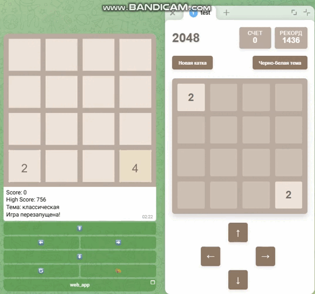
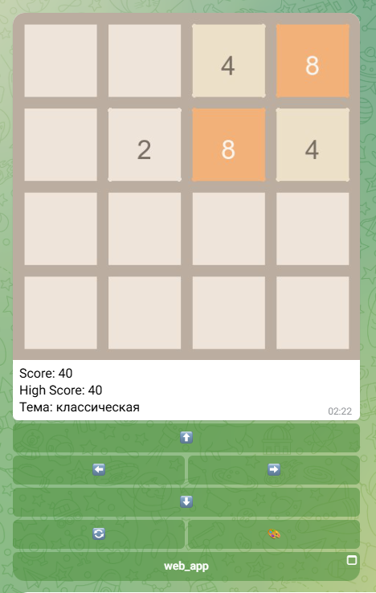
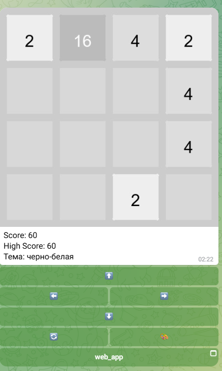
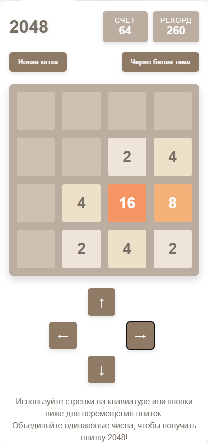
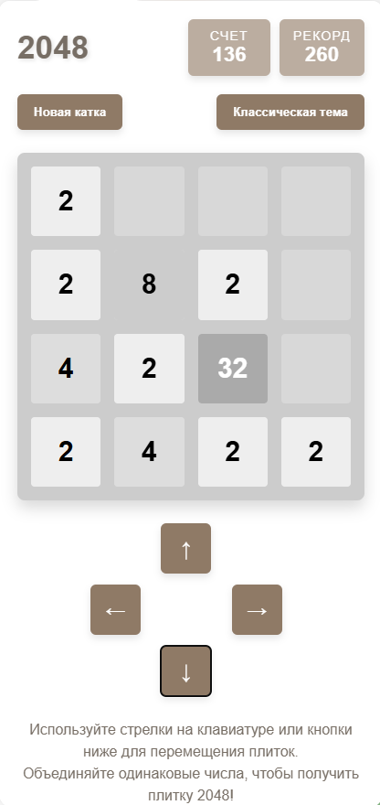
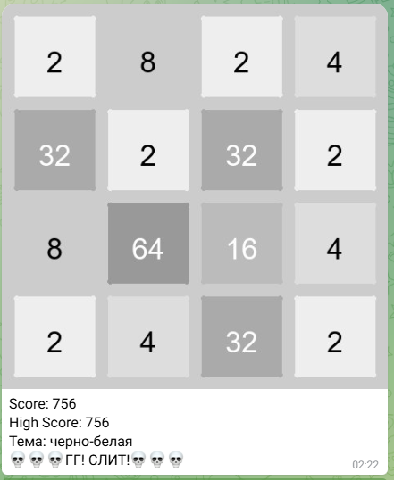
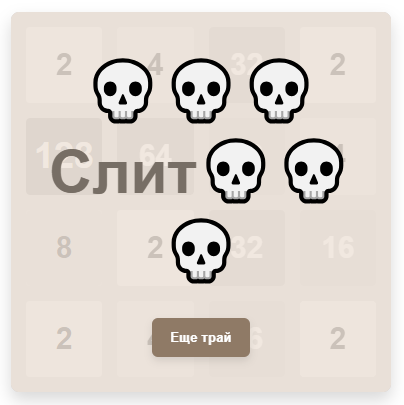
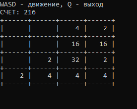

# 🎮 Telegram-Bot-2048-Game-TG-WebApp


Полнофункциональный клон классической игры 2048, реализованный в виде умного Telegram-бота с интерактивной веб-версией. Проект демонстрирует навыки full-stack разработки: от backend-логики и работы с базами данных до создания frontend-интерфейса и интеграции с Telegram API.



## ✨ Ключевые особенности

#### 🤖 Полноценный Telegram-бот: Управление инлайн-кнопками, графика (реализовано с помощью генерации изображений).

#### 🌐 Адаптивное Веб-приложение: Отдельная версия игры для браузера с сенсорным управлением и клавиатурным вводом, а также кнопками для управления.

#### 🎨 Две темы оформления: Классическая цветная и черно-белая тема. Выбор сохраняется.

#### 💾 Сохрание состояния игры в чат боте: Реализовано через БД Postgresql и сохранение через localstorage в веб апп.

#### 📱 Полная адаптивность: Веб апп адапатирован под компьютеры и для мобильных устройств.

#### 🔄 Технологический стек: Aiogram 3.x, PIL/Pillow, SQLAlchemy, PostgreSQL, JavaScript, HTML5, CSS3.

## 🖼 Скриншоты

> ### 1. Скриншот чата с телеграмм ботом
> 
> #### Классическая тема чат бота:
> 
> 
> 
> #### Черно-белая тема чат бота:
> 
> 
> 
> ### 2. Скриншот веб-аппа
>
> #### Классическая тема веб-аппа:
> 
> 
> 
> #### Черно-белая тема веб-аппа:
> 
> 
> 
> ### 3. Сообщение об проигрыше
> 
> #### Проигрыш в чат боте:
> 
> 
> 
> #### Проигрыш в веб-аппе:
> 
> 

## 🚀 Как запустить проект

### Предварительные требования

* Python 3.10 или новее.
* Telegram Bot Token (получить у [@BotFather](https://t.me/BotFather)).
* База данных PostgreSQL, можно использовать SQLite.
* Веб-сервер для развертывания приложения (в данном случае веб приложение развернуто на GitHub Pages, это бесплатно, но в этом также есть и минус - крайне тяжело реализовать синхронизацию прогресса между ботом и веб-аппом, требуются костыли).

### Установка и настройка

1. **Клонируйте репозиторий:**
    ```bash
    git clone https://github.com/AgapFelg/Telegram-Bot-2048-Game-TG-WebApp.git
   cd Telegram-Bot-2048-Game-TG-WebApp
    ```
2. **Создайте виртуальное окружение и создайте зависимости:**
    ```bash
   python -m venv venv
   source venv/bin/activate # для юникс систем
   # Или
   venv\Scripts\activate # для винды
   # ---
   pip install -r requirements.txt
   ```
3. **Настройте переменные окружения:**
    Отредактируйте существующий файл .env вставив свои данные:
    ```ini
    BOT_TOKEN - токен вашего бота
    DATABASE_URI - для postgresql: postgresql://пользователь:пароль@адрес_БД:порт/имя_БД
    # Пользователь - имя пользователя БД, по умолчанию postgres
    # Пароль - пароль пользователя БД, по умолчанию 123
    # Адрес_БД - адрес по которому будет стучаться до БД, по умолчанию localhost (127.0.0.1)
    # Порт - порт, по которому БД слушает запросы, по умолчанию 5432 или 5433
    # Имя БД - имя которое присвоено базе данных, по умолчанию test
    # !!! Не стоит использовать данные по умолчанию в среде, отличной от тестовой
    # Или для SQLite: sqlite:///./database.db
    WEB_APP_URL - ссылка на веб апп, по умолчанию https://agapfelg.github.io/Telegram-Bot-2048-Game-TG-WebApp/
    ```
4. **Создание таблиц**
    ```psql
    CREATE DATABASE test;
    # Таблицы создадутся автоматически при запуске бота, SQLAlchemy создаст (там одна таблица)
    ```
5. **Запустите бота**
    ```bash
    python main.py
    ```
6. **Разверните веб-приложение**
    Файлы 'index.html', 'style.css', 'script.js' являются статическими. Их можно разместить на любом веб-сервере (Nginx, Apache) или хостинге статики (Github Pages, Netlify, Vercel). Можно использовать существующее юрл на моем гитхаб пагес.

## 📖 Как играть

*   **В Telegram-боте:** Начните общение с ботом командой `/start`. Используйте инлайн-кнопки (⬆️➡️⬇️⬅️) для перемещения плиток. Кнопки "🔄" (Рестарт) и "🎨" (Смена темы) также доступны.
*   **В Веб-приложении:**
    *   *На компьютере:* Используйте клавиши-стрелки на клавиатуре или кнопки виртуального джойстика.
    *   *На телефоне:* Используйте сенсорные свайпы в нужном направлении или нажимайте на кнопки виртуального джойстика.

**Цель игры:** Объединяйте плитки с одинаковыми числами, чтобы получить плитку **2048**!

## 🏗 Архитектура проекта
```
Telegram-Bot-2048-Game-TG-WebApp/   # Директория проекта
├── game/                   # Директория бота
│   ├── uploads/            # Автоматически создаваемая папка для сгенерированных изображений
│   ├── .env                # Файл с переменными окружения (токен бота, настройки БД)
│   ├── config.py           # Конфигурация приложения (чтение переменных окружения)
│   ├── game_core.py        # Ядро игры - логика 2048 (движение, объединение плиток)
│   ├── game_graphic.py     # Генерация изображений игрового поля для бота (PIL)
│   ├── handlers.py         # Обработчики сообщений и callback'ов для Aiogram
│   ├── inline_keyboard.py  # Создание инлайн-клавиатуры управления игрой
│   ├── main.py             # Точка входа - запуск Telegram бота
│   ├── models.py           # Модели SQLAlchemy (таблица пользователей)
│   └── requirements.txt    # Зависимости Python
├── screenshots/            # Папка для скриншотов проекта
├── index.html             # Главная страница веб-приложения
├── script.js              # Логика клиентской части веб-приложения
└── style.css              # Стили веб-приложения
```
## 🔧 Технологии

*   **Backend (Бот):**
    *   `Aiogram 3.x` - Асинхронный фреймворк для Telegram Bot API
    *   `SQLAlchemy` - ORM для работы с базой данных
    *   `PostgreSQL` / `SQLite` - Системы управления базами данных
    *   `Pillow (PIL)` - Генерация изображений игрового поля
    *   `environs` - Управление настройками через переменные окружения

*   **Frontend (Веб-приложение):**
    *   `Vanilla JavaScript` - Чистый JS без сторонних фреймворков
    *   `CSS3 Grid & Flexbox` - Современная верстка и адаптивный дизайн
    *   `HTML5` - Семантическая разметка
    *   `Local Storage` - Сохранение темы и рекорда на клиенте

# Бонус - game_core.py можно запустить и поиграть в консольную версию игры 2048

(Раслкадка клавиатуры должна быть английская)



## 👨‍💻 Автор

**Нагорный Д** (Agap Felg)

*   GitHub: [https://github.com/AgapFelg](https://github.com/AgapFelg)
*   Telegram: [https://t.me/kagatuta](@kagatuta)

## 📄 Лицензия

Этот проект распространяется под лицензией MIT. См. файл `LICENSE` для получения дополнительной информации.